# 🚀 Cerebral Platform - Complete CI/CD System Guide

**Last Updated**: October 24, 2025  
**Status**: ✅ Production Ready  
**Build System**: Tekton (ONLY) - GitHub Actions NOT used for builds

---

## 📋 Quick Reference

| Component | Status | Details |
|-----------|--------|---------|
| **Build System** | ✅ Active | Tekton Pipelines + Kaniko in Kubernetes |
| **Webhook Receiver** | ✅ Running | Rust service, 2 replicas (tekton-pipelines) |
| **Ingress** | ✅ Configured | webhook.dev.cerebral.baerautotech.com:3000 |
| **GitHub Integration** | ✅ Ready | Push webhook to https://webhook.dev.cerebral.baerautotech.com/ |
| **Registry** | ✅ Available | 10.34.0.202:5000 (internal, HTTP) |
| **Deployment** | ✅ Automated | Zero-downtime rollouts on image push |

---

## 🏗️ Architecture Diagram

```mermaid
graph TB
    A["👤 Developer<br/>Local Machine"] -->|1. git push| B["🐙 GitHub<br/>Repository"]
    
    B -->|2. GitHub Webhook<br/>HTTPS POST| C["🌐 Ingress nginx<br/>webhook.dev.cerebral.baerautotech.com"]
    
    C -->|3. Routes to port 3000| D["⚙️ github-webhook-receiver<br/>Rust Service<br/>2 Replicas"]
    
    D -->|4. Validates signature<br/>Creates PipelineRun| E["🔧 Tekton PipelineRun<br/>cerebral-pipelines ns"]
    
    E --> F["📦 Pipeline Tasks"]
    
    F -->|Task 1| F1["git-clone-task<br/>Clone repository<br/>Extract commit info"]
    F -->|Task 2| F2["kaniko-build-task<br/>Build Docker image<br/>Inside Kubernetes"]
    F -->|Task 3| F3["deploy-task<br/>Update K8s deployment<br/>Zero-downtime rollout"]
    
    F1 --> G["📚 Git Repo<br/>Source code<br/>All branches"]
    F2 --> H["🐳 Internal Registry<br/>10.34.0.202:5000<br/>cerebral/service:branch"]
    F3 --> I["☸️ Kubernetes Cluster<br/>cerebral-platform ns<br/>Live services"]
    
    I -->|Services available| J["👥 End Users<br/>Web/Mobile/API"]
    
    style A fill:#e1f5ff
    style B fill:#fff3e0
    style C fill:#f3e5f5
    style D fill:#e8f5e9
    style E fill:#fce4ec
    style F fill:#fff9c4
    style H fill:#ffe0b2
    style I fill:#c8e6c9
    style J fill:#b3e5fc
```



---

## 🔄 Complete Build Flow (Step-by-Step)

### 1. Developer Pushes Code
```bash
cd ~/Development/cerebral
git add -A
git commit -m "feat: Add new feature"
git push origin main  # ← This triggers everything
```

### 2. GitHub Fires Webhook
- **URL**: `https://webhook.dev.cerebral.baerautotech.com/`
- **Method**: POST
- **Headers**: 
  - `X-Hub-Signature-256`: HMAC validation
  - `X-GitHub-Event`: push
- **Body**: Repository info, commit SHA, changed files
- **Signature Secret**: Stored in `github-webhook-secret` (sealed)

### 3. Ingress Routes to Webhook Receiver
```yaml
# k8s/ci-cd/webhook-receiver-ingress.yaml
spec:
  rules:
  - host: webhook.dev.cerebral.baerautotech.com
    http:
      paths:
      - backend:
          service:
            name: github-webhook-receiver  # Port 3000
          port:
            number: 3000  # ⚠️ CRITICAL
```

### 4. Webhook Receiver Validates & Creates PipelineRun
```bash
# Inside Rust service:
1. Validate GitHub signature (HMAC-SHA256)
2. Extract from webhook:
   - Repository name
   - Branch name
   - Commit SHA
   - Changed files
3. Create Tekton PipelineRun YAML
4. Apply to cluster
```

### 5. Tekton Pipeline Executes

#### Task 1: git-clone-task
```bash
# Clones repository
# Sets working directory
# Exports: repo url, branch, commit sha
```

#### Task 2: kaniko-build-task
```bash
# Builds Docker image using Kaniko
# Runs INSIDE Kubernetes (no Docker daemon needed)
# Image format: 10.34.0.202:5000/cerebral/SERVICE:BRANCH
# Pushes to internal registry
```

#### Task 3: deploy-task
```bash
# Updates Kubernetes deployment
# Uses kubectl set image
# Triggers rolling update
# Zero-downtime deployment
```

### 6. Services Update Automatically
- New pods start with new image
- Old pods gracefully terminate
- Users experience zero downtime
- Deployment complete ✅

---

## 📁 Critical Files (Source of Truth)

### 1. Ingress Configuration
```
k8s/ci-cd/webhook-receiver-ingress.yaml
```
**What**: Routes webhook.dev.cerebral.baerautotech.com → github-webhook-receiver:3000  
**Port**: 3000 (NOT 80!)  
**Edit**: Edit this file, then apply with `kubectl apply -f`  
**Never**: Don't manually patch the ingress

### 2. Webhook Receiver Deployment
```
tekton-pipelines/github-webhook-receiver
```
**Image**: 10.34.0.202:5000/webhook-receiver:latest  
**Replicas**: 2  
**Port**: 3000  
**Secret**: github-webhook-secret (HMAC validation)

### 3. Tekton Components
```
tekton-pipelines/
├── cerebral-microservice-pipeline  (Main pipeline)
├── git-clone-task                 (Clone repo)
├── kaniko-build-task              (Build image)
└── deploy-task                    (Update deployment)
```

### 4. Validation Script
```
scripts/validate-webhook-receiver.sh
```
**Run**: `./scripts/validate-webhook-receiver.sh`  
**Checks**: Port 3000, deployment health, secret exists  
**Exit Code**: 0 = OK, 1 = ERROR

---

## 🎯 How to Use the CI/CD System

### Deploy New Code

```bash
# Step 1: Make changes
cd ~/Development/cerebral
# ... make your changes ...

# Step 2: Commit
git add -A
git commit -m "feat: Your feature description"

# Step 3: Push (this triggers everything!)
git push origin main

# Step 4: Watch it build
kubectl get pipelineruns -n cerebral-pipelines -w
```

### Monitor Build

```bash
# List all builds
kubectl get pipelineruns -n cerebral-pipelines

# Watch a specific build
kubectl logs -f -n cerebral-pipelines <pipelinerun-name>

# Check if pods updated
kubectl get pods -n cerebral-platform
kubectl get deployment -n cerebral-platform
```

### Debug if Build Fails

```bash
# Step 1: Validate infrastructure
./scripts/validate-webhook-receiver.sh

# Step 2: Check webhook logs
kubectl logs -n tekton-pipelines -l app.kubernetes.io/name=github-webhook-receiver -f

# Step 3: Check pipeline logs
kubectl logs -n cerebral-pipelines <pipelinerun-name> -f

# Step 4: Check if image exists in registry
curl http://10.34.0.202:5000/v2/_catalog
```

---

## 🔐 Configuration Reference

### Environment Variables

| Name | Value | Location |
|------|-------|----------|
| `PORT` | 3000 | github-webhook-receiver deployment |
| `GITHUB_WEBHOOK_SECRET` | (from secret) | github-webhook-secret |
| `KUBE_NAMESPACE` | tekton-pipelines | github-webhook-receiver |

### Secrets

| Name | Location | Contains |
|------|----------|----------|
| `github-webhook-secret` | tekton-pipelines | HMAC validation token |
| `docker-config` | build-system | Registry auth |

### Registry URLs

| Purpose | URL | Access |
|---------|-----|--------|
| Inside cluster | `http://10.34.0.202:5000` | HTTP (internal) |
| Outside cluster | `registry.dev.cerebral.baerautotech.com` | HTTPS (via ingress) |
| Kube imagespec | `10.34.0.202:5000/cerebral/SERVICE:TAG` | Direct IP |

---

## ⚙️ Configuration Checklist

### GitHub Configuration
- [ ] Repository has webhook pointing to `https://webhook.dev.cerebral.baerautotech.com/`
- [ ] Webhook is sending "Push events"
- [ ] Webhook is "Active"
- [ ] Secret matches `github-webhook-secret` in cluster

### Kubernetes Configuration
- [ ] Ingress exists and routes to port 3000
- [ ] Webhook receiver pod is running (2 replicas)
- [ ] `github-webhook-secret` exists
- [ ] Tekton pipelines installed
- [ ] Registry is accessible

### Testing Configuration
```bash
# Test webhook endpoint
curl -X POST https://webhook.dev.cerebral.baerautotech.com/ \
  -H "Content-Type: application/json" \
  -d '{"test":"payload"}'

# Should respond with 400 (invalid signature) or 200 (success)
```

---

## 🛠️ Troubleshooting Guide

### Issue: "Connection refused" when accessing webhook.dev.cerebral.baerautotech.com

**Solution**:
```bash
# Check ingress port
kubectl get ingress cerebral-github-listener -n cerebral-development -o yaml | grep "number:"

# Should show: number: 3000
# If showing: number: 80, regenerate ingress

kubectl apply -f k8s/ci-cd/webhook-receiver-ingress.yaml
```

### Issue: Webhook not being received

**Solution**:
```bash
# Check webhook logs
kubectl logs -n tekton-pipelines -l app.kubernetes.io/name=github-webhook-receiver -f

# Check if pod received the request
# Should show incoming POST request

# Verify secret matches
kubectl get secret github-webhook-secret -n tekton-pipelines -o yaml | grep secretToken
```

### Issue: Build stuck or failed

**Solution**:
```bash
# List builds
kubectl get pipelineruns -n cerebral-pipelines

# Check specific build
kubectl describe pipelinerun <name> -n cerebral-pipelines

# View task logs
kubectl logs -n cerebral-pipelines <pipelinerun-name> -f
```

### Issue: Image not in registry

**Solution**:
```bash
# Check registry
curl http://10.34.0.202:5000/v2/_catalog

# If image missing, check build logs
kubectl logs -n cerebral-pipelines <pipelinerun-name> -f

# Look for "kaniko-build-task" logs
```

---

## 🚫 What NOT to Do

### ❌ Never manually patch ingress
```bash
kubectl patch ingress cerebral-github-listener -n cerebral-development ...
# WRONG! This reverts next `kubectl apply`
```

### ❌ Never edit ingress directly
```bash
kubectl edit ingress cerebral-github-listener -n cerebral-development
# WRONG! Manual edits aren't in git
```

### ❌ Never run old kubectl apply
```bash
kubectl apply -f old-config-with-port-80.yaml
# WRONG! This reverts our fixes
```

### ❌ Never bypass the webhook receiver
```bash
# Manual kubectl apply to create PipelineRun
# WRONG! Breaks the automation system
```

---

## ✅ What TO Do

### ✅ Edit source file and apply
```bash
vim k8s/ci-cd/webhook-receiver-ingress.yaml
kubectl apply -f k8s/ci-cd/webhook-receiver-ingress.yaml
```

### ✅ Validate after changes
```bash
./scripts/validate-webhook-receiver.sh
```

### ✅ Commit everything to git
```bash
git add -A
git commit -m "fix: Update ingress configuration"
git push origin main
```

### ✅ Let the system work automatically
```bash
# Push code → Webhook fires → Tekton builds → Deployment updates
# No manual intervention needed!
```

---

## 📊 Performance Metrics

| Metric | Value | Notes |
|--------|-------|-------|
| Webhook latency | < 100ms | From GitHub to receiver |
| Build time | 2-5 min | Depends on image size |
| Deployment time | 30-60 sec | Rolling update |
| Total pipeline | 3-7 min | From push to live |
| Pod startup | 10-30 sec | Container pull + health checks |

---

## 🔗 Related Documentation

| Document | Purpose |
|----------|---------|
| `WEBHOOK_RECEIVER_CONFIGURATION.md` | Detailed webhook receiver config |
| `SESSION_COMPLETE_OCTOBER_24.md` | Session summary + what was fixed |
| `scripts/validate-webhook-receiver.sh` | Validation script |
| `.github/workflows/` | GitHub Actions (metadata only, NOT for builds) |

---

## 📞 Support

### Quick Fixes
1. Run validation: `./scripts/validate-webhook-receiver.sh`
2. Read: `WEBHOOK_RECEIVER_CONFIGURATION.md`
3. Check logs: `kubectl logs -n tekton-pipelines ...`

### Common Issues
- **Port 80 instead of 3000**: Apply ingress config
- **Webhook not received**: Check secret and ingress
- **Build failed**: Check pipeline logs
- **Deployment stuck**: Check pod logs in cerebral-platform

---

## 🎯 Summary

**The System**:
- GitHub push → Webhook → Tekton → Build → Deploy
- Completely automated
- Zero manual intervention
- Configuration in git (won't revert)

**How to Use**:
- Push code: `git push`
- Watch build: `kubectl get pipelineruns -w`
- Monitor deployment: `kubectl get pods`

**Prevention**:
- Edit config files (not kubectl patch)
- Run validation script
- Commit everything to git
- Read documentation if stuck

**Status**: ✅ Production Ready - Rock Solid
