# 🚀 Cerebral Platform - Complete CI/CD System Guide

**Last Updated**: October 24, 2025
**Status**: ✅ Production Ready
**Build System**: Tekton (ONLY) - GitHub Actions NOT used for builds

---

## 📋 Quick Reference

| Component              | Status        | Details                                                        |
| ---------------------- | ------------- | -------------------------------------------------------------- |
| **Build System**       | ✅ Active     | Tekton Pipelines + Kaniko in Kubernetes                        |
| **Webhook Receiver**   | ✅ Running    | Rust service, 2 replicas (tekton-pipelines)                    |
| **Ingress**            | ✅ Configured | webhook.dev.cerebral.baerautotech.com:3000                     |
| **GitHub Integration** | ✅ Ready      | Push webhook to https://webhook.dev.cerebral.baerautotech.com/ |
| **Registry**           | ✅ Available  | 10.34.0.202:5000 (internal, HTTP)                              |
| **Deployment**         | ✅ Automated  | Zero-downtime rollouts on image push                           |

---

## 🏗️ Architecture Diagram

```mermaid
graph TB
    A["👤 Developer<br/>Local Machine"] -->|1. git push| B["🐙 GitHub<br/>Repository"]

    B -->|2. GitHub Webhook<br/>HTTPS POST| C["🌐 Ingress nginx<br/>webhook.dev.cerebral.baerautotech.com"]

    C -->|3. Routes to port 3000| D["⚙️ github-webhook-receiver<br/>Rust Service<br/>2 Replicas"]

    D -->|4. Validates signature<br/>Creates PipelineRun| E["🔧 Tekton PipelineRun<br/>tekton-pipelines ns"]

    E --> F["📦 Pipeline Tasks"]

    F -->|Task 1| F1["git-clone-task<br/>Clone repository<br/>Extract commit info"]
    F -->|Task 2| F2["kaniko-build-task<br/>Build Docker image<br/>Inside Kubernetes"]
    F -->|Task 3| F3["deploy-task<br/>Update K8s deployment<br/>Zero-downtime rollout"]

    F1 --> G["📚 Git Repo<br/>Source code<br/>All branches"]
    F2 --> H["🐳 Internal Registry<br/>10.34.0.202:5000<br/>cerebral/service:branch"]
    F3 --> I["☸️ Kubernetes Cluster<br/>cerebral-platform ns<br/>Live services"]

    I -->|Services available| J["👥 End Users<br/>Web/Mobile/API"]

    style A fill:#e1f5ff
    style B fill:#fff3e0
    style C fill:#f3e5f5
    style D fill:#e8f5e9
    style E fill:#fce4ec
    style F fill:#fff9c4
    style H fill:#ffe0b2
    style I fill:#c8e6c9
    style J fill:#b3e5fc
```



---

## 🔄 Complete Build Flow (Step-by-Step)

### 1. Developer Pushes Code

```bash
cd ~/Development/cerebral
git add -A
git commit -m "feat: Add new feature"
git push origin main  # ← This triggers everything
```

### 2. GitHub Fires Webhook

- **URL**: `https://webhook.dev.cerebral.baerautotech.com/`
- **Method**: POST
- **Headers**:
  - `X-Hub-Signature-256`: HMAC validation
  - `X-GitHub-Event`: push
- **Body**: Repository info, commit SHA, changed files
- **Signature Secret**: Stored in `github-webhook-secret` (sealed)

### 3. Ingress Routes to Webhook Receiver

```yaml
# k8s/ci-cd/webhook-receiver-ingress.yaml
spec:
  rules:
    - host: webhook.dev.cerebral.baerautotech.com
      http:
        paths:
          - backend:
              service:
                name: github-webhook-receiver # Port 3000
              port:
                number: 3000 # ⚠️ CRITICAL
```

### 4. Webhook Receiver Validates & Creates PipelineRun

```bash
# Inside Rust service:
1. Validate GitHub signature (HMAC-SHA256)
2. Extract from webhook:
   - Repository name
   - Branch name
   - Commit SHA
   - Changed files
3. Create Tekton PipelineRun YAML
4. Apply to cluster
```

### 5. Tekton Pipeline Executes

#### Task 1: git-clone-task

```bash
# Clones repository
# Sets working directory
# Exports: repo url, branch, commit sha
```

#### Task 2: kaniko-build-task

```bash
# Builds Docker image using Kaniko
# Runs INSIDE Kubernetes (no Docker daemon needed)
# Image format: 10.34.0.202:5000/cerebral/SERVICE:BRANCH
# Pushes to internal registry
```

#### Task 3: deploy-task

```bash
# Updates Kubernetes deployment
# Uses kubectl set image
# Triggers rolling update
# Zero-downtime deployment
```

### 6. Services Update Automatically

- New pods start with new image
- Old pods gracefully terminate
- Users experience zero downtime
- Deployment complete ✅

---

## 🐳 Base Images - Fast Build Foundation

### What Are Base Images?

Base images are pre-built Docker images with all common ML/AI dependencies pre-installed. When your microservice builds, instead of installing 200+ packages, it just uses the pre-built base and adds service-specific code.

**Impact**: Build time reduces from 30+ minutes to 2-3 minutes!

### Available Base Images

| Image            | Purpose                  | Size   | Registry Location                        |
| ---------------- | ------------------------ | ------ | ---------------------------------------- |
| **ai-base:cuda** | GPU-accelerated services | ~7.5GB | `10.34.0.202:5000/cerebral/ai-base:cuda` |
| **ai-base:cpu**  | CPU-only services        | ~2.8GB | `10.34.0.202:5000/cerebral/ai-base:cpu`  |

### Using Base Images in Dockerfiles

When building a microservice, use this pattern:

```dockerfile
# Build argument for base image selection
ARG REGISTRY=10.34.0.202:5000
ARG BASE_TAG=cuda  # or 'cpu' for CPU-only

FROM ${REGISTRY}/cerebral/ai-base:${BASE_TAG}

# Add service-specific code
WORKDIR /app
COPY . /app

# Add service-specific dependencies (if needed)
RUN pip install -r requirements.txt

# Start service
CMD ["python", "-m", "uvicorn", "main:app"]
```

**Example: ai-services Dockerfile**

```dockerfile
ARG BASE=internal-registry.registry.svc.cluster.local:5000/cerebral/ai-base:cuda
FROM ${BASE}

WORKDIR /app
COPY . /app
RUN pip install -r requirements.txt
CMD ["python", "main.py"]
```

### Inside Kaniko Pipeline

When Kaniko builds in the pipeline, it automatically:

1. Pulls the base image from `10.34.0.202:5000`
2. Adds your code on top
3. Pushes the result to the registry

```yaml
# In your PipelineRun
- name: kaniko-build-task
  params:
    - name: image-name
      value: cerebral/ai-services
    - name: dockerfile
      value: microservices/ai-services/Dockerfile
```

The Dockerfile references the base image → Kaniko pulls it → Build completes in minutes!

### Services Using Base Images

**All AI/ML services use one of the base images:**

- `ai-services` → CUDA version
- `bmad-services` → CUDA version
- `data-services` → CUDA version
- `knowledge-services` → CUDA version
- `integration-services` → CUDA or CPU
- `monitoring-services` → CUDA version
- All 12+ other microservices

### Registry Access

**Inside Kubernetes (Kaniko builds):**

```
Internal URL: http://10.34.0.202:5000/v2/cerebral/ai-base/tags/list
```

**From your local machine:**

```bash
# Check available base images
curl -s http://10.34.0.202:5000/v2/cerebral/ai-base/tags/list

# Expected response:
{"name":"cerebral/ai-base","tags":["cuda","cpu"]}
```

---

## 🔄 Maintaining & Updating Base Images

### When to Update Base Images

Update when:

- ✅ Adding shared dependencies needed by multiple services
- ✅ Security patches (PyTorch, transformers, etc.)
- ✅ Python version upgrade
- ✅ CUDA version change
- ✅ OS base image update

Do NOT update for single-service dependencies - add those in the service's `requirements.txt`.

### Complete Update Procedure

**Step 1: Update shared dependencies**

```bash
vim ~/Development/cerebral/docker/requirements-unified.txt
# Add/update packages needed by multiple services
```

**Step 2: Test both images locally**

```bash
cd ~/Development/cerebral

# Test CUDA version
docker build -f docker/Dockerfile.ai-base.cuda -t test-cuda .
docker run --rm test-cuda python -c "import torch; print(torch.__version__)"

# Test CPU version
docker build -f docker/Dockerfile.ai-base.cpu -t test-cpu .
docker run --rm test-cpu python -c "import torch; print(torch.__version__)"
```

**Step 3: If Dockerfile changes needed**

```bash
# Edit Dockerfile if build dependencies changed
vim ~/Development/cerebral/docker/Dockerfile.ai-base.cuda
vim ~/Development/cerebral/docker/Dockerfile.ai-base.cpu
```

**Common Dockerfile changes:**

- Add build dependencies: `gcc`, `g++`, `python3-dev`
- Update base image: `python:3.11-slim` → `python:3.12-slim`
- Update CUDA: `nvidia/cuda:12.4.1` → `nvidia/cuda:13.0`

**Step 4: Build both images for real**

```bash
cd ~/Development/cerebral

# ✅ CORRECT: Build for BOTH architectures (amd64 for cluster, arm64 for Mac)
docker buildx build \
  --platform linux/amd64,linux/arm64 \
  -f docker/Dockerfile.ai-base.cuda \
  -t cerebral/ai-base:cuda \
  --push .

docker buildx build \
  --platform linux/amd64,linux/arm64 \
  -f docker/Dockerfile.ai-base.cpu \
  -t cerebral/ai-base:cpu \
  --push .

# ❌ WRONG - Single architecture only (will break cluster):
# docker build -f docker/Dockerfile.ai-base.cuda -t cerebral/ai-base:cuda .
```

**Why multi-platform?**

- Mac (Apple Silicon) = ARM64 architecture
- Kubernetes cluster = AMD64 architecture
- Single-arch builds only work for one OS
- Multi-platform builds support both automatically
- Kaniko in cluster gets AMD64, Mac gets ARM64

**Step 5: Verify both architectures in registry**

```bash
# Verify CUDA image has both architectures
curl -s http://10.34.0.202:5000/v2/cerebral/ai-base/manifests/cuda \
  -H "Accept: application/vnd.oci.image.index.v1+json" | \
  jq '.manifests[] | select(.platform.architecture != "unknown") | .platform.architecture'

# Should output:
# "amd64"
# "arm64"

# Same for CPU image
curl -s http://10.34.0.202:5000/v2/cerebral/ai-base/manifests/cpu \
  -H "Accept: application/vnd.oci.image.index.v1+json" | \
  jq '.manifests[] | select(.platform.architecture != "unknown") | .platform.architecture'
```

**Step 6: Tag and push to internal registry**

✅ **If using docker buildx with --push** (recommended above):

- Images automatically pushed during build
- Skip this step - already done!
- Verify with curl commands above

⚠️ **If building locally without --push:**

```bash
# Tag both images
docker tag cerebral/ai-base:cuda 10.34.0.202:5000/cerebral/ai-base:cuda
docker tag cerebral/ai-base:cpu 10.34.0.202:5000/cerebral/ai-base:cpu

# Push both
docker push 10.34.0.202:5000/cerebral/ai-base:cuda
docker push 10.34.0.202:5000/cerebral/ai-base:cpu
```

**Step 7: Commit changes to git**

```bash
cd ~/Development/cerebral
git add docker/requirements-unified.txt docker/Dockerfile.ai-base.*
git commit -m "chore: Update base images (multi-architecture)

Changes:
- Updated torch to v2.5.0
- Added new dependency: spacy-transformers
- Added build-essential, gcc, g++, python3-dev
- Built for both amd64 (cluster) and arm64 (Mac)"
git push origin main
```

**Step 8: Trigger microservice rebuilds**

```bash
# All services using base images will rebuild on next push
git commit --allow-empty -m "rebuild: microservices with updated base images"
git push origin main

# Or manually
kubectl delete pods -n cerebral-platform -l app=ai-services
```

### Dockerfile Changes Reference

**Why add build dependencies?**

When you `pip install` packages like `psutil`, `cryptography`, `numpy`, they need to compile C extensions. Without build tools, the install fails.

```dockerfile
RUN apt-get update && apt-get install -y --no-install-recommends \
    build-essential \           # Meta-package: gcc, g++, make
    gcc g++ \                   # C/C++ compilers
    python3-dev \               # Python.h headers (for extensions)
    git curl ca-certificates \  # Other tools
  && rm -rf /var/lib/apt/lists/
```

### What's Included in Base Images

**ML/AI Stack:**

- torch, transformers, pandas, numpy, scikit-learn, scipy
- sentence-transformers, spacy, nltk, chromadb, onnxruntime

**Data & API:**

- FastAPI, uvicorn, Pydantic, SQLAlchemy, Redis, Supabase

**Observability:**

- Prometheus, OpenTelemetry, structlog

**See Full List:**

```bash
cat ~/Development/cerebral/docker/requirements-unified.txt
```

---

## 📁 Critical Files (Source of Truth)

### 1. Ingress Configuration

```
k8s/ci-cd/webhook-receiver-ingress.yaml
```

**What**: Routes webhook.dev.cerebral.baerautotech.com → github-webhook-receiver:3000
**Port**: 3000 (NOT 80!)
**Edit**: Edit this file, then apply with `kubectl apply -f`
**Never**: Don't manually patch the ingress

### 2. Webhook Receiver Deployment

```
tekton-pipelines/github-webhook-receiver
```

**Image**: 10.34.0.202:5000/webhook-receiver:latest
**Replicas**: 2
**Port**: 3000
**Secret**: github-webhook-secret (HMAC validation)

### 3. Tekton Components

```
tekton-pipelines/
├── cerebral-microservice-pipeline  (Main pipeline)
├── git-clone-task                 (Clone repo)
├── kaniko-build-task              (Build image)
└── deploy-task                    (Update deployment)
```

### 4. Validation Script

```
scripts/validate-webhook-receiver.sh
```

**Run**: `./scripts/validate-webhook-receiver.sh`
**Checks**: Port 3000, deployment health, secret exists
**Exit Code**: 0 = OK, 1 = ERROR

---

## 🎯 How to Use the CI/CD System

### Deploy New Code

```bash
# Step 1: Make changes
cd ~/Development/cerebral
# ... make your changes ...

# Step 2: Commit
git add -A
git commit -m "feat: Your feature description"

# Step 3: Push (this triggers everything!)
git push origin main

# Step 4: Watch it build
kubectl get pipelineruns -n tekton-pipelines -w
```

### Monitor Build

```bash
# List all builds
kubectl get pipelineruns -n tekton-pipelines

# Watch a specific build
kubectl logs -f -n tekton-pipelines <pipelinerun-name>

# Check if pods updated
kubectl get pods -n cerebral-platform
kubectl get deployment -n cerebral-platform
```

### Debug if Build Fails

```bash
# Step 1: Validate infrastructure
./scripts/validate-webhook-receiver.sh

# Step 2: Check webhook logs
kubectl logs -n tekton-pipelines -l app.kubernetes.io/name=github-webhook-receiver -f

# Step 3: Check pipeline logs
kubectl logs -n tekton-pipelines <pipelinerun-name> -f

# Step 4: Check if image exists in registry
curl http://10.34.0.202:5000/v2/_catalog
```

---

## 🔐 Configuration Reference

### Environment Variables

| Name                    | Value            | Location                           |
| ----------------------- | ---------------- | ---------------------------------- |
| `PORT`                  | 3000             | github-webhook-receiver deployment |
| `GITHUB_WEBHOOK_SECRET` | (from secret)    | github-webhook-secret              |
| `KUBE_NAMESPACE`        | tekton-pipelines | github-webhook-receiver            |

### Secrets

| Name                    | Location         | Contains              |
| ----------------------- | ---------------- | --------------------- |
| `github-webhook-secret` | tekton-pipelines | HMAC validation token |
| `docker-config`         | build-system     | Registry auth         |

### Registry URLs

| Purpose         | URL                                      | Access              |
| --------------- | ---------------------------------------- | ------------------- |
| Inside cluster  | `http://10.34.0.202:5000`                | HTTP (internal)     |
| Outside cluster | `registry.dev.cerebral.baerautotech.com` | HTTPS (via ingress) |
| Kube imagespec  | `10.34.0.202:5000/cerebral/SERVICE:TAG`  | Direct IP           |

---

## ⚙️ Configuration Checklist

### GitHub Configuration

- [ ] Repository has webhook pointing to `https://webhook.dev.cerebral.baerautotech.com/`
- [ ] Webhook is sending "Push events"
- [ ] Webhook is "Active"
- [ ] Secret matches `github-webhook-secret` in cluster

### Kubernetes Configuration

- [ ] Ingress exists and routes to port 3000
- [ ] Webhook receiver pod is running (2 replicas)
- [ ] `github-webhook-secret` exists
- [ ] Tekton pipelines installed
- [ ] Registry is accessible

### Testing Configuration

```bash
# Test webhook endpoint
curl -X POST https://webhook.dev.cerebral.baerautotech.com/ \
  -H "Content-Type: application/json" \
  -d '{"test":"payload"}'

# Should respond with 400 (invalid signature) or 200 (success)
```

---

## 🛠️ Troubleshooting Guide

### Issue: "Connection refused" when accessing webhook.dev.cerebral.baerautotech.com

**Solution**:

```bash
# Check ingress port
kubectl get ingress cerebral-github-listener -n cerebral-development -o yaml | grep "number:"

# Should show: number: 3000
# If showing: number: 80, regenerate ingress

kubectl apply -f k8s/ci-cd/webhook-receiver-ingress.yaml
```

### Issue: Webhook not being received

**Solution**:

```bash
# Check webhook logs
kubectl logs -n tekton-pipelines -l app.kubernetes.io/name=github-webhook-receiver -f

# Check if pod received the request
# Should show incoming POST request

# Verify secret matches
kubectl get secret github-webhook-secret -n tekton-pipelines -o yaml | grep secretToken
```

### Issue: Build stuck or failed

**Solution**:

```bash
# List builds
kubectl get pipelineruns -n tekton-pipelines

# Check specific build
kubectl describe pipelinerun <name> -n tekton-pipelines

# View task logs
kubectl logs -n tekton-pipelines <pipelinerun-name> -f
```

### Issue: Image not in registry

**Solution**:

```bash
# Check registry
curl http://10.34.0.202:5000/v2/_catalog

# If image missing, check build logs
kubectl logs -n tekton-pipelines <pipelinerun-name> -f

# Look for "kaniko-build-task" logs
```

---

## 🚫 What NOT to Do

### ❌ Never manually patch ingress

```bash
kubectl patch ingress cerebral-github-listener -n cerebral-development ...
# WRONG! This reverts next `kubectl apply`
```

### ❌ Never edit ingress directly

```bash
kubectl edit ingress cerebral-github-listener -n cerebral-development
# WRONG! Manual edits aren't in git
```

### ❌ Never run old kubectl apply

```bash
kubectl apply -f old-config-with-port-80.yaml
# WRONG! This reverts our fixes
```

### ❌ Never bypass the webhook receiver

```bash
# Manual kubectl apply to create PipelineRun
# WRONG! Breaks the automation system
```

---

## ✅ What TO Do

### ✅ Edit source file and apply

```bash
vim k8s/ci-cd/webhook-receiver-ingress.yaml
kubectl apply -f k8s/ci-cd/webhook-receiver-ingress.yaml
```

### ✅ Validate after changes

```bash
./scripts/validate-webhook-receiver.sh
```

### ✅ Commit everything to git

```bash
git add -A
git commit -m "fix: Update ingress configuration"
git push origin main
```

### ✅ Let the system work automatically

```bash
# Push code → Webhook fires → Tekton builds → Deployment updates
# No manual intervention needed!
```

---

## 📊 Performance Metrics

| Metric          | Value     | Notes                          |
| --------------- | --------- | ------------------------------ |
| Webhook latency | < 100ms   | From GitHub to receiver        |
| Build time      | 2-5 min   | Depends on image size          |
| Deployment time | 30-60 sec | Rolling update                 |
| Total pipeline  | 3-7 min   | From push to live              |
| Pod startup     | 10-30 sec | Container pull + health checks |

---

## 🔗 Related Documentation

| Document                               | Purpose                                        |
| -------------------------------------- | ---------------------------------------------- |
| `WEBHOOK_RECEIVER_CONFIGURATION.md`    | Detailed webhook receiver config               |
| `SESSION_COMPLETE_OCTOBER_24.md`       | Session summary + what was fixed               |
| `scripts/validate-webhook-receiver.sh` | Validation script                              |
| `.github/workflows/`                   | GitHub Actions (metadata only, NOT for builds) |

---

## 📞 Support

### Quick Fixes

1. Run validation: `./scripts/validate-webhook-receiver.sh`
2. Read: `WEBHOOK_RECEIVER_CONFIGURATION.md`
3. Check logs: `kubectl logs -n tekton-pipelines ...`

### Common Issues

- **Port 80 instead of 3000**: Apply ingress config
- **Webhook not received**: Check secret and ingress
- **Build failed**: Check pipeline logs
- **Deployment stuck**: Check pod logs in cerebral-platform

---

## 🎯 Summary

**The System**:

- GitHub push → Webhook → Tekton → Build → Deploy
- Completely automated
- Zero manual intervention
- Configuration in git (won't revert)

**How to Use**:

- Push code: `git push`
- Watch build: `kubectl get pipelineruns -w`
- Monitor deployment: `kubectl get pods`

**Prevention**:

- Edit config files (not kubectl patch)
- Run validation script
- Commit everything to git
- Read documentation if stuck

**Status**: ✅ Production Ready - Rock Solid
